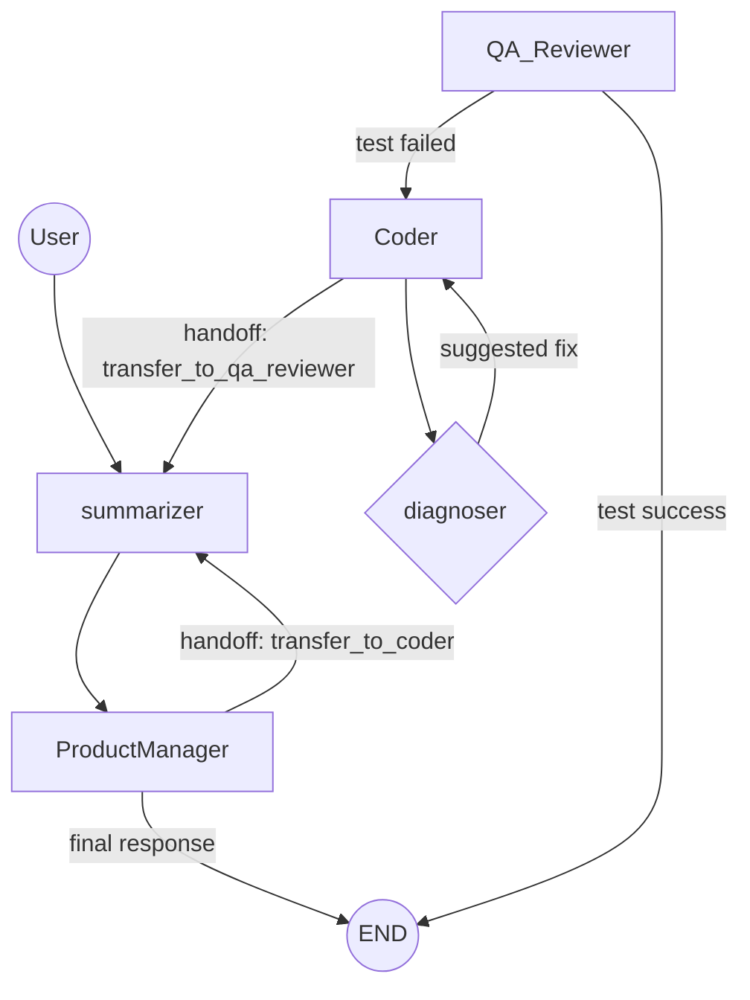

# Production Agent: 架构设计全景概览

欢迎使用 **Production Agent** 项目。本指南旨在为具有资深工程背景但初涉 AI 领域的开发者提供一套系统化的架构视角，深入解构自主智能体（Autonomous Agents）的底层原理。

---

## 🏗 核心设计范式：从“确定性编程”到“自主推理”

传统软件工程依赖于 if-else 等确定性逻辑，而本项目基于 **ReAct (Reasoning + Acting)** 范式。

### 什么是 ReAct？
在每一次交互中，智能体并非随机调用工具，而是遵循以下闭环逻辑：
1.  **Thought (推理)**：利用 LLM 的逻辑能力，分析当前任务现状与目标的差距。
2.  **Action (行动)**：根据推理结论，选择最合适的工具（Tool）。
3.  **Observation (观察)**：接收工具执行的结果（如读取的文件内容、报错等）。
4.  **Repeat (迭代)**：将观察结果纳入上下文，更新思维，开启下一轮推理。

---

## 🧩 系统逻辑分层

我们的架构通过解耦智能、资源和数据，实现了生产级的稳定性。

### 1. 编排层 (Orchestrator Layer) - `core/swarm.py`
采用了基于 **LangGraph** 的有向有环图拓扑：
-   **StateGraph**: 核心驱动引擎。将任务流转从硬编码 `while` 循环升级为基于状态转移的图计算。
-   **四角色专家系统**: PM, Architect, Coder, QA_Reviewer。每个角色通过 `handoff_tool` 传递控制权。

### 2. 异步状态与内存管理 (Async State & Memory) - `core/context.py` & `summarizer`
-   **SQLite Saver**: 集成了 LangGraph Checkpointer，使用 `aiosqlite` 实现非中断式的对话落盘。
-   **Summarizer 节点**: 异步检测对话长度。当 Token 成本过高时，利用 LLM 自动生成历史摘要并重置消息历史，极大提高长对话效率。

### 3. 持久化层 (Persistence) - `managers/`
-   **`database.py`**: 单例数据库助手。
-   **`tasks.py`**: 任务跟踪系统，支持将复杂需求拆解为原子任务。

### 4. 稳健工具层 (Resilient Tools) - `tools/`
-   **Docker 沙盒**: 自动执行危险命令隔离。
-   **Tool Resilience**: 内置容灾机制。如果 Docker 未启动，系统会自动回退到本地执行并给出警告，而不是直接崩溃。
-   **Graph RAG**: 结合 `ASTTools` 和 `RAGTools`，实现代码关系感知（如类继承关系）的语义搜索。
-   **MCP 传输**: 支持 stdio 和 HTTP/JSON-RPC 两种传输模式。

### 5. 技能系统 (Skills) - `skills/`
-   **SkillRegistry**: 自动发现和加载内置技能。
-   **use_skill 工具**: 统一调用接口，支持 `debug_explain`, `generate_test`, `api_design_review`, `dependency_analysis`, `code_migration` 等技能。

---

## ⚙️ 系统时序图 (Data Flow)

以下展示了当用户输入一个指令时，系统内部的流转逻辑：

---

## ⚡️ 异步事件驱动 (Async Event Drive)

项目的实时性依赖于 LangGraph 的 `astream_events` 机制：
1. **事件流抛出**：引擎在执行每一个 Step (Node Start, Tool End等) 时，都会异步抛出一个事件。
2. **实时渲染处理器**：`core/swarm.py` 中的 `_process_stream_events` 协程负责捕获这些事件，并分发给对应的查表处理器进行 UI 渲染。
3. **并发安全性**：由于整个拓扑是无锁异步的，Agent 可以在等待大模型响应的同时，通过回调更新前端状态。

---

## 🚀 开发者自研建议

作为软件工程师，你可以通过以下切入点深度定制项目：
-   **扩展编排流**：在 `core/swarm.py` 中定义新的 LangGraph 节点。
-   **增强自愈逻辑**：在 `diagnose_error` 函数中增加针对特定库（如 React/Node）的错误处理模版。
-   **强化感知能力**：通过 `MCP` 接入公司内部的专有 API 或数据库。

> [!IMPORTANT]
> **设计哲学**：在智能体开发中，应尽可能将**复杂的确定性逻辑**（如数学计算、关系提取）封装为 **Python Tool**，而将**模糊的需求理解和决策控制**留给 **LLM**。
