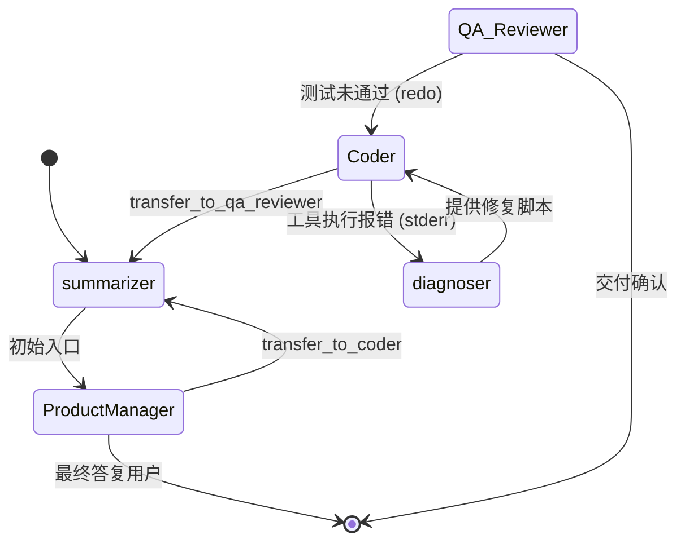

# Swarm 拓扑与编排设计 (Swarm Topology)

在 **Production Agent** 中，我们利用 **LangGraph** 实现了一套工业级的多智能体协同系统。不再通过简单的 Loop，而是通过有向有环图来管理复杂的推理流转。

---

## 🎨 核心拓扑：基于状态转移的专家系统

本项目采用了 **Swarm (蜂群)** 范式，其精髓在于“控制权”的动态流转。每个智能体都是图中的一个节点，通过工具调用触发边缘跳转。

### 1. 四大核心专家角色
-   **ProductManager (PM)**：需求守门员。负责拆解任务、澄清需求、并在任务完成时交接给用户。
-   **Architect (架构师)**：技术领航员。扫描代码库 (AST/RAG)，制定实施方案。
-   **Coder (开发者)**：执行者。针对具体文件执行读写、补丁修复和本地命令测试。
-   **QA_Reviewer (质检员)**：最后防线。执行集成测试、代码审查，并具备联网搜索最新 API 文档的能力。

### 2. 特殊辅助节点
-   **`summarizer` (总结节点)**：所有流转的中转站。当对话超过 25 轮或 Token 数过载时，它会自动压缩历史，确保上下文不溢出且请求成本可控。
-   **`diagnoser` (自愈节点)**：当 `Coder` 或 `QA` 在执行 Bash 命令/代码片段报错时（如环境缺失、格式错误），系统会自动跳入此节点。LLM 会分析 `stderr` 并给出针对性修复建议（如 `pip install`），实现无人值守的故障自愈。

---

## 🤝 控制权转移机制 (Handoff Logic)

### 1. 技术实现：`handoff_tool`
我们使用了 `langgraph-swarm` 提供的 `create_handoff_tool`。当智能体调用 `transfer_to_coder` 等工具时：
1.  当前节点的 ReAct 循环终止。
2.  `active_agent` 状态被修改为目标角色。
3.  控制权跳回 `summarizer`，由其路由到下一个专家节点。

### 2. 上下文的继承与清洗
-   **继承**：新节点会继承之前的任务列表 (`todo`) 和消息序列。
-   **清洗 (SystemMessage Scrubbing)**：为了解决某些模型（如 Anthropic）不允许多条 SystemMessage 的限制，系统在进入新节点前会清洗旧的身份指令，并注入当前角色的专属指令。

---

## 🧬 典型流转流程

---

## 🚀 开发者扩展指南

要增加一个新角色（如 `Security_Auditor`）：
1.  **定义工具**：在 `tools/registry.py` 中定义其专属工具集。
2.  **注册节点**：在 `core/swarm.py` 的 `_build_swarm` 中将其添加到 `role_names`。
3.  **注入 Handoff**：系统会自动为其他角色生成 `transfer_to_security_auditor` 工具。
4.  **配置权限**：在 `config/governance.yaml` 中配置其 RBAC 权限。

> [!TIP]
> **设计经验**：Swarm 的精髓在于**动态限制**。在每一时刻，我们只给模型提供最精准的 5-8 个工具，这比一次性塞给它 50 个工具的成功率要高出数倍，幻觉率也更低。
